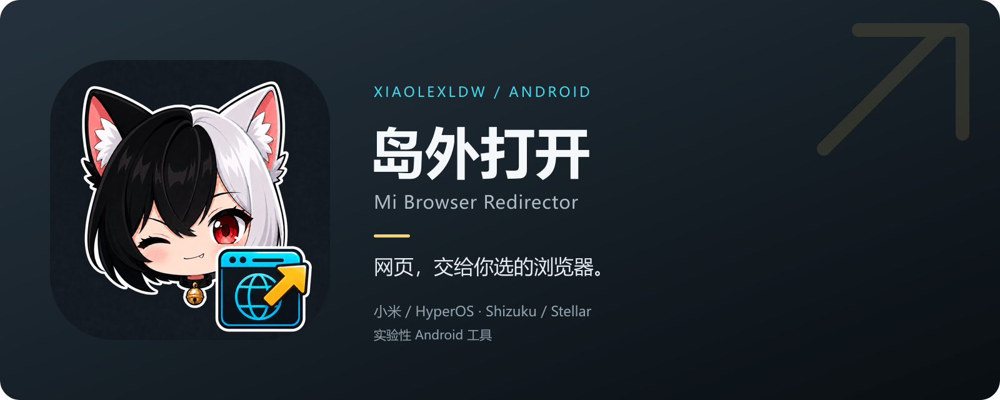

<p align="center">
  
</p>

# 岛外打开 · Mi Browser Redirector

让小米系统交给小米浏览器的网页，改由你选择的浏览器打开。

[GitHub 仓库](https://github.com/XiaoLeXLDW/fuck-mi-aicr-default-browser) ·
[下载 APK](https://github.com/XiaoLeXLDW/fuck-mi-aicr-default-browser/releases/tag/v0.3.4) ·
[问题反馈](https://github.com/XiaoLeXLDW/fuck-mi-aicr-default-browser/issues) ·
[自动构建](https://github.com/XiaoLeXLDW/fuck-mi-aicr-default-browser/actions/workflows/android.yml)

面向小米 / HyperOS 的实验性 Android 工具。通过 **Shizuku 或 Stellar** 提供的特权服务，
观察系统对 `com.android.browser` 的网页启动请求，提取 HTTP/HTTPS 网址并转交目标浏览器。
支持通过 ADB 启动权限服务，无需 Root；本项目与 Xiaomi、Shizuku、Stellar 均无官方隶属关系。

**当前版本：v0.3.4 Pre-release。** 下载、签名与校验信息见
[版本说明](docs/releases/v0.3.4.md)。
本版官方 Shizuku、Stellar 原生、冷启动与异常恢复仍待手机验收；静态构建通过不能证明真实跳转。
源码中的 `minSdk 26` 表示最低可安装 Android 8.0，不代表所有 ROM 都能接管。

[快速开始](docs/wiki/Getting-Started.md) · [Wiki](docs/wiki/Home.md) ·
[兼容说明](docs/SHIZUKU_COMPATIBILITY.md) · [构建](docs/BUILDING.md) · [更新记录](CHANGELOG.md)



## 能做什么

- **观察或接管**：先观察可提取的网址，再决定是否启用实际跳转。
- **选择目标浏览器**：图标、名称和包名单选菜单；选择草稿在点“开启接管”后才应用。
  要求同时具有通用 HTTP 与 HTTPS 处理能力，排除受域名、路径或文件类型限制的网页入口。
- **两条权限后端**：官方 Shizuku API 与 Stellar 原生 API；自动模式优先 Stellar。
- **明确退出**：点“停用并退出服务”，清理控制器并等待 UserService Binder 死亡。

应用**不修改系统默认浏览器设置，也不处理应用内 WebView**。“兼容服务（原生 API）”是
页面对 Stellar 原生后端的称呼，不代表当前连接的是官方 Shizuku Manager。

## 使用步骤

1. 从 [v0.3.4 Pre-release](https://github.com/XiaoLeXLDW/fuck-mi-aicr-default-browser/releases/tag/v0.3.4) 下载 universal APK 安装，并安装一个可通用处理 HTTP 与 HTTPS 的目标浏览器。
2. 从 [Shizuku 官方下载页](https://shizuku.rikka.app/zh-hans/download/)或
   [Stellar 上游 Releases](https://github.com/roro2239/Stellar/releases)安装管理器，按其指引启动服务。
   打开“岛外打开”，点“开启接管”时按提示授予所选后端权限；详见[首次配置](docs/wiki/Getting-Started.md)。
3. 选择目标浏览器，保持“观察模式”，点“开启接管”并触发原来会打开小米浏览器的入口。
4. 确认“最近事件”能观察到目标网址后，关闭观察模式，再点“开启接管”使修改生效。
5. 使用结束后点“停用并退出服务”，等待“停止完成”。划掉最近任务或结束页面不等于停止后台服务。

当前 universal APK 沿用历史测试证书，附带 SHA-256 校验文件。安装更新需要**包名与签名兼容**；
未来若改用正式证书，需另行处理升级关系。
保留现有安装前先看[构建与签名说明](docs/BUILDING.md)。首次无线调试配对另需时间。

## 兼容情况

| 环境 | 当前实现 | 验证边界 |
|---|---|---|
| 官方 Shizuku Manager | 官方 API / Provider 13.1.5 | 已有静态检查；官方管理器真机流程仍待验 |
| Stellar | 页面称“兼容服务（原生 API）”；原生权限、Binder 和 token UserService | 已有静态检查；本版真机流程仍待验 |
| 两个管理器同时运行 | 自动优先 Stellar；检测到原生 Stellar 时拒绝新建 Shizuku 会话 | 真机冲突与切换待验 |
| Sui / 其他 ROM | 未作兼容承诺 | 未验证 |

切换后端前先停用当前服务。详见[兼容与协议](docs/SHIZUKU_COMPATIBILITY.md)和
[真机验收清单](docs/实机验收.md)。

## 范围与限制

- 只处理目标为 `com.android.browser`、action 为 `ACTION_VIEW` 且 data 可提取网页地址的请求。
  网页内嵌 WebView、只有 extras 的请求及其他浏览器包名不在范围内。
- 合法 HTTP/HTTPS 地址优先保留；也尝试有限层数的编码地址和常见 wrapper 查询参数。
  观察模式、解析失败、入队失败及回调异常会放行。
- 接管任务入队后即阻止原启动。随后目标浏览器启动失败或超时，**不会自动回退小米浏览器**。
- 使用系统全局 `IActivityController`，可能受 ROM 限制或被其他工具覆盖；避免同时使用
  `am monitor`、Monkey 或其他控制器，也无法查询它是否已被替换。目标启动仍使用 `--user current`，
  没有原请求的用户身份，暂不承诺工作资料、系统分身或跨用户兼容。顶部固定 `72dp` 安全距保留，
  大字体、折叠和无障碍体验仍需实机确认。
- 最近事件通常展示域名；完整网址仍会短暂进入内存和 `am start` 参数，系统或浏览器可能记录它。
  本项目未实现遥测或上传服务，详见[隐私说明](docs/PRIVACY.md)。

## 从源码构建

Windows + PowerShell 7 + JDK 17，工具和缓存保存在项目内：

```powershell
.\scripts\bootstrap.ps1
.\scripts\build.ps1 -Variant Debug
```

首次构建需要联网下载 Android SDK、Gradle 和 Maven 依赖。Debug APK 可供自行测试；
Release 默认输出未签名包。跨平台 Wrapper 命令、正式签名和本地测试签名均见
[BUILDING.md](docs/BUILDING.md)。CI 同时检查 Debug / Release，上传开发签名 Debug APK、
未签名 Release APK 和报告，不持有发行密钥、不自动发布。当前版本的本地及远端验证状态见
[构建证据](docs/BUILD_EVIDENCE.md)。

## 项目导航

| 内容 | 入口 |
|---|---|
| 使用、排障、工作原理 | [Wiki 首页](docs/wiki/Home.md) |
| 完整文档索引 | [docs/README.md](docs/README.md) |
| 图标、仓库封面与家族视觉规范 | [品牌与资源](docs/BRANDING.md) |
| GitHub 推送、Wiki 发布与 Release | [发布指南](docs/GITHUB_RELEASE_CHECKLIST.md) |
| 问题反馈与代码贡献 | [CONTRIBUTING.md](CONTRIBUTING.md) |
| 安全问题与隐私 | [SECURITY.md](SECURITY.md) · [PRIVACY.md](docs/PRIVACY.md) |

## 许可证与致谢

本项目原创代码和文档采用 [MIT](LICENSE)。上游接口与依赖保留各自许可证，
逐项来源及许可证全文见 [THIRD_PARTY_NOTICES.md](THIRD_PARTY_NOTICES.md)。

感谢 [Shizuku](https://github.com/RikkaApps/Shizuku-API)、
[Stellar](https://github.com/roro2239/Stellar-API) 和
[Android Open Source Project](https://android.googlesource.com/platform/frameworks/base/) 提供相关接口与实现。
