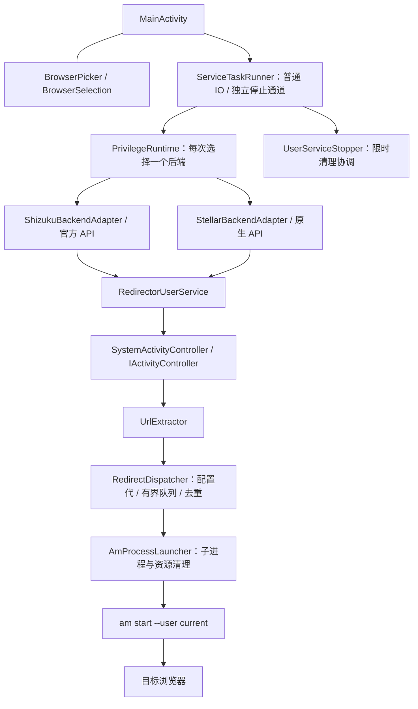

# 构建、架构与验收

下列输出名以当前版本 **v0.3.5（code 12 / 协议 200 / 服务代 30006）** 为例。
`build.ps1` 从源码读取版本并生成文件名；最终以 `app/build.gradle`、`ServiceIdentity.java` 和
构建日志为准。修改 APK 文件名不会改变包内版本或签名。当前发布产物与更新说明见
[GitHub Release](https://github.com/XiaoLeXLDW/fuck-mi-aicr-default-browser/releases/tag/v0.3.5)，校验值见同名 `.sha256` 附件。

## 工具版本

| 工具 | 当前配置 |
|---|---|
| Java | JDK 17；需要 `java` 和 `keytool` |
| Gradle | Wrapper 固定 8.9，发行包 SHA-256 固定 |
| Android Gradle Plugin | 8.7.3 |
| Android SDK | Platform 35、Build Tools 35.0.0；App minSdk 26 / targetSdk 35 |
| Windows 脚本 | PowerShell 7；SDK、缓存、开发密钥保存在项目内 |

## Windows 开发构建

在项目根目录运行，确保 `JAVA_HOME` 指向已有 JDK 17：

```powershell
.\scripts\bootstrap.ps1
.\scripts\build.ps1 -Variant Debug
```

首次需要下载依赖和接受 Android SDK 许可；bootstrap 默认交互展示许可。
已阅读并同意许可的无人值守环境可显式使用 `-AcceptSdkLicenses`。
脚本不安装 JDK。若 PowerShell 阻止脚本执行，可在当前终端使用
`Set-ExecutionPolicy -Scope Process Bypass`，无需更改全局策略。

按上述版本构建会输出 `dist/MiBrowserRedirector-debug-debug-signed-v0.3.5.apk` 和同名 `.sha256`。
新克隆会生成项目内 `.local/debug.keystore`，不同克隆的开发证书可能不同。

```powershell
.\scripts\install.ps1 -Apk .\dist\MiBrowserRedirector-debug-debug-signed-v0.3.5.apk
```

安装会操作 ADB 设备；多个设备时追加 `-Serial`。不能覆盖不同签名的现有安装，脚本不会自动卸载。

## Release 与签名类型

```powershell
.\scripts\build.ps1 -Variant Release
```

无签名配置时输出 `dist/MiBrowserRedirector-release-unsigned-v0.3.5.apk`。这是可检查的构建产物，
**不能直接安装或当作已签名发行包**。每次构建脚本只为所选 Variant 执行单测、Lint，另做 UI 结构检查、
Manifest/包名/版本检查，并按签名类型验证 APK。

| 配置 | 输出标签 | 用途 |
|---|---|---|
| Debug 默认 | `debug-signed` | 自行开发测试 |
| Release 无签名配置 | `unsigned` | CI / 检查 / 后续签名 |
| 四项发布环境变量齐全 | `signed` | 使用指定证书；证书来源与用途由维护者核验 |
| `-LocalTestSigning` | `local-test` | 显式复用已有历史测试证书 |

正式签名读取四个环境变量：`REDIRECTOR_KEYSTORE`（密钥路径）、`REDIRECTOR_STORE_PASSWORD`、
`REDIRECTOR_KEY_ALIAS`、`REDIRECTOR_KEY_PASSWORD`。请通过私有终端或受保护的构建环境设置；
不要把真实密码写进命令历史、README、GitHub Actions 文件或提交的 `.properties`。
必须全部设置，或全部不设置；部分配置会报错。当前 CI 不读取发行密钥、不自动发布。

需要保持本机历史 APK 的签名兼容时：

```powershell
.\scripts\build.ps1 -Variant Release -LocalTestSigning
```

此模式要求已有 `keys/redirector-test.jks`，不会生成替代密钥，输出标签为 `local-test`。
切换正式证书前需考虑升级连续性；包名相同也不能直接跨证书覆盖。

## Linux / macOS / Android Studio

使用已有 JDK 17 与 Android SDK，设置 `ANDROID_HOME`，或在不提交的 `local.properties` 指定 `sdk.dir`。
SDK 需包含 `platforms;android-35` 和 `build-tools;35.0.0`。在项目根目录运行：

```bash
export GRADLE_USER_HOME="$PWD/.gradle-user-home"
bash ./gradlew --no-daemon :app:testReleaseUnitTest :app:lintRelease :app:assembleRelease
```

直接 Wrapper 的 APK 在 `app/build/outputs/apk/release/`，不会自动复制到 `dist/`；
没有签名配置时文件为 `app-release-unsigned.apk`。Wrapper 支持
`-PlocalTestSigning=true`，但只有保存着原测试密钥的维护者环境可使用。

Windows `bootstrap.ps1` / `build.ps1` / ADB 辅助脚本依赖 `.bat` / `.exe` 工具；
其他平台使用 Wrapper。`verify-ui.ps1` 与 `verify-repository.ps1` 可通过 PowerShell 7 跨平台运行。

## 验证与报告位置

Java 测试统一通过 Gradle 运行；Debug / Release 单测均已依赖 `:app:testStellarLifecycle`，
无需另跑一套快速测试脚本。Windows 在项目根目录执行：

```powershell
$env:GRADLE_USER_HOME = Join-Path (Get-Location) '.gradle-user-home'
$env:ANDROID_HOME = Join-Path (Get-Location) '.tools/android-sdk'
$env:ANDROID_SDK_ROOT = $env:ANDROID_HOME
.\gradlew.bat --no-daemon :app:testDebugUnitTest :app:testReleaseUnitTest :app:lintDebug :app:lintRelease
.\scripts\verify-repository.ps1
.\scripts\verify-ui.ps1
.\tests\verify-stop.Tests.ps1
.\tests\verify-stop-process.Tests.ps1
.\tests\current-docs.Tests.ps1
```

Linux / macOS 将 Gradle 命令前缀换为 `bash ./gradlew`，设置本地 `GRADLE_USER_HOME`；
PowerShell 回归使用 PowerShell 7。后四类检查分别覆盖 UI、ADB 辅助脚本和当前文档约束，
不会连接手机。`verify-repository.ps1` 还检查 Wrapper、许可证副本与版本字段。

`testStellarLifecycle` 直接编译原生会话生产源码，使用仅位于测试目录内的 Android/管理器替身，
替身不进入 APK；其报告在 `app/build/test-results/testStellarLifecycle/`。
标准单测报告在 `app/build/reports/tests/`，Lint 在 `app/build/reports/lint-results-*.html`。
这些检查覆盖解析、浏览器资格/选择、会话归属、调度、停止和子进程清理，但不能证明 ROM 的隐藏
API、管理器授权界面、真实超级岛链接、视觉效果或停止后的系统行为。

[Android checks](../.github/workflows/android.yml) 同时运行 Debug / Release 单测、Lint、构建及
离线 PowerShell 回归，上传开发签名 `app-debug.apk`、未签名 `app-release-unsigned.apk` 和报告，
附件保留 14 天。开发证书不保证跨 CI 运行或与既有安装兼容；工作流没有发行密钥或自动发布步骤。

修改根许可证或第三方声明后，同步 `app/src/main/assets/licenses/` 对应文本；仓库检查会检查副本一致性。

## 版本与权限接口

| 版本 | versionCode | 业务协议 | 服务代 | 状态 |
| --- | --- | --- | --- | --- |
| v0.3.5 | 12 | 200 | 30006 | Pre-release；本版手机验收待完成 |

应用 ID 为 `dev.codex.mibrowserredirector`；页面的“Stellar（原生 API）”对应 Stellar 原生路径。
管理器报告的“服务 API”是另一组版本，不能代替业务协议检查。

| 项目 | 官方 Shizuku | Stellar 原生 |
| --- | --- | --- |
| 客户端 | `dev.rikka.shizuku:api/provider:13.1.5` | 本地 `NativeStellar` 与 Stellar AIDL |
| Provider | `${applicationId}.shizuku` | `${applicationId}.stellar` |
| 权限流 | `Shizuku.checkSelfPermission/requestPermission` | 原生 `stellar` 权限 |
| UserService | `redirector_shizuku`、稳定 tag、`UserServiceArgs` | `redirector`、原生 token 与 verification token |
| 停止 | `unbindUserService(args, connection, true)` | `stopUserService(token)` |

接口依据的固定上游版本：[Shizuku-API a27f6e4](https://github.com/RikkaApps/Shizuku-API/tree/a27f6e4151ba7b39965ca47edb2bf0aeed7102e5)、
[Shizuku b844bc4](https://github.com/RikkaApps/Shizuku/tree/b844bc491f1790c72328e1a8e5b2349f8978f0ea)、
[Stellar abba17f](https://github.com/roro2239/Stellar/tree/abba17f64737663e06d87fa82eb57dfbb982f163)、
[Stellar-API e22b3a0](https://github.com/roro2239/Stellar-API/tree/e22b3a0c76305c57a36696b069938d3c356a290b)。
接口源码与许可证见[第三方声明](../THIRD_PARTY_NOTICES.md)。
## 架构

应用把界面生命周期、权限后端和浏览器重定向分开。**两个后端共享业务服务，每次会话只归属于创建它的一个后端。**



### 模块与约束

| 模块 | 责任 |
| --- | --- |
| `MainActivity`、浏览器菜单类 | 本地配置、菜单草稿、启停状态与后台服务连接；点开启才提交草稿 |
| `BrowserDiscovery`、`BrowserEligibility` | 根据公开 IntentFilter 查询/判断通用 HTTP 与 HTTPS 处理能力；排除仅处理特定链接的入口 |
| `ServiceTaskRunner` | 应用进程内共享的有界任务通道：普通 IO 单线程/队列 8，停止单线程/队列 1，避免普通 RPC 卡住时饿死停止协调 |
| `PrivilegeRuntime` 与两个 adapter | 后端可用性、授权、会话固定、后端专属移除与来源 Binder 检查 |
| `NativeStellarUserService` | 原生连接记录固定来源管理器，区分可信业务 Binder 与待清理身份，保留晚到 token 与失败清理记录；页面回调不直接执行停止 RPC |
| `RedirectorUserService` | 注册 Controller、筛选目标与动作、记录最近事件；把跳转交给调度器 |
| `RedirectDispatcher` | 配置代隔离、有界等待队列、按目标/网址去重、取消旧任务与发布当前配置的结果；回调提交不等待锁 |
| `AmProcessLauncher` | 单个 `am` 子进程的参数、创建、限时等待、输出读取、取消和 finally 资源清理；不拼 shell 字符串 |
| `UrlExtractor`、`SystemActivityController` | 有边界的网址解析；反射连接 ActivityManager / ActivityTaskManager 控制器接口 |
| `UserServiceStopper` 与 Binder helper | disable、后端 stop/remove、destroy 补救、Binder 死亡确认 |

业务服务与主 Activity 分处进程。Stellar（页面称“Stellar（原生 API）”）后缀是 `redirector`，
Shizuku 是 `redirector_shizuku`；v0.3.5 使用协议 `200` / 服务代 `30006`。
页面退出清理本页连接引用，daemon 可继续运行。
Shizuku SDK 按整个 tag 解绑；`ShizukuTagOwnership` 跟踪本地归属，旧页面仅注销自身回调，
适配器确认 tag 归属安全时才调用 SDK 解绑，以免破坏新页面会话。

### 一次接管

1. Controller 回调只继续处理 `com.android.browser` 的 `ACTION_VIEW`。
2. 从 `Intent.data` 提取 HTTP/HTTPS；无法解析或处于观察模式时放行。
3. `RedirectDispatcher` 按配置代、目标与网址去重：任务等待或运行时抑制重复，成功后保留 1.5 秒窗口，失败允许立即重试。专用 worker 使用容量 8 的等待队列；停用或配置变更使旧待执行任务失效。
4. 队列满、配置过期或锁忙时提交失败并放行；入队成功或命中重复项立即拒绝原启动，worker 经 `AmProcessLauncher` 使用独立参数调用 `/system/bin/am start`。
5. 命令等待预算为 10 秒；结束后在 finally 中终止/回收子进程、关闭流并限时等待输出线程。失败或超时只更新状态，没有自动恢复原小米启动的路径；操作系统调用本身不保证可强制打断。

网址作为 `ProcessBuilder` 参数传入，不拼成 shell 命令。完整网址仍会出现在进程参数与内存，隐私边界见[隐私说明](PRIVACY.md)。

配置切换与真正创建进程共用提交锁，已提交系统的启动无法撤回；系统 Controller 回调使用
`tryLock`，不会等待这把锁或等待 `am` 执行完成。成功去重项按后续提交/容量清理，不是 URL 删除定时器。

### 一次停止

应用先持久保存停用意图，再调用 `disable()` 注销 Controller，然后通过原后端移除 UserService。Shizuku 使用原 `UserServiceArgs`，Stellar 使用原生 token；必要时通过已持有的业务 Binder 发送 destroy。

以上业务调用只用于未被拒绝的会话。token 验证失败、协议不兼容或协议读取超时会撤销业务调用
资格，只通过来源管理器移除；原始 Binder 保留用于死亡观测。原生记录的拒绝状态跨页面租约
保留，不会因为换页面重新变成可信。Shizuku 会话固定保存来源管理器 Binder；来源变化时拒绝向替换后的管理器执行 remove。原生停止 RPC 失败或 token 晚到时保留记录供受监督清理/重试。AIDL destroy 方法编号为 `16777114`，实际 Binder 事务码为 `16777115`。

只有 Binder 死亡才算完成。停止超时保留后端归属；页面操作代和会话身份检查用于阻止旧回调覆盖
新状态。后端切换必须等待停止完成，
因为系统全局 `IActivityController` 不能由两套会话同时使用。

`ServiceTaskRunner` 的独立停止通道运行协调，`UserServiceStopper` 再用有界 RPC worker 执行
disable/remove/destroy/存活检查，以单调时钟约束总等待。已连接清理预算最多 4 秒；页面显式
停用还设有 12 秒总截止时间，包含重新连接等前置步骤。超时报告未确认，已发出的同步 Binder
调用可能仍在进行，不能把本地取消当作远端已终止；旧调用未结束前禁止重新开启。

本应用不更改系统默认浏览器、不处理 WebView。全局 Controller 可能被其他工具替换且无可靠的
所有权查询；`--user current` 不携带原请求的用户身份，工作资料/分身不在已验证范围。

源码根目录在 `app/src/main/java/dev/codex/mibrowserredirector/`。隐藏接口编译桩位于 `hidden-api-stub`，不替代设备上的真实系统接口。

## 发布流程

先固定源码提交，检查 `git status --short`、`git diff --check` 和 `git remote -v`，确认版本号、
versionCode、下载入口与功能描述一致。发布提交的 Android checks 应通过；新版本更新身份表、
隐私适用版本和更新记录。签名私钥、SDK、缓存、设备日志和 `dist/` 产物不提交。

1. 完成前述离线检查，按下方清单单独记录设备验收；未测场景写“未执行”，测试签名不表示稳定版。
2. 递增源码版本号和 versionCode，固定新版本标签并从该提交构建，核验包名、版本、签名、大小和 SHA-256；持有原密钥时才使用 `build.ps1 -Variant Release -LocalTestSigning`。
3. 将已签名 APK 命名为 `MiBrowserRedirector-v<版本号>-universal.apk` 并生成同名 `.sha256`，使用该标签创建 Pre-release。正文只列最多三条用户可感知的变化及必要的实验版本/未验收提示，不堆测试数量或哈希表。
4. 回下载附件核对大小、SHA-256、签名及标签指向，保留对应源码和第三方许可证；更换正式证书前处理覆盖升级关系。
5. 更新 README 与极简 CHANGELOG；发布正文只维护 GitHub Release，不在仓库复制版本说明。通过新版本交付安装包变更，不移动旧标签或覆盖旧附件。

新克隆使用 Debug 或未签名 Release，不能生成可覆盖历史安装的替代密钥。
历史变化简记在 [CHANGELOG](../CHANGELOG.md)，历史检查结果不作为当前工作区的验证结果。
## 实机验收

**v0.3.5 实机验收待执行。** 离线通过、正常停止通过、故障注入正确报告与恢复必须分别记录。 本页覆盖官方 Shizuku、Stellar 原生路径、异常恢复与浏览器筛选。

### 测试准备

使用目标 Xiaomi / HyperOS 设备、支持通用 HTTP/HTTPS 的小米浏览器以外的浏览器，以及本次构建的**已签名** v0.3.5 APK。未签名 APK 不能直接安装；覆盖安装要求包名、签名相容且版本允许。不要为解决签名冲突直接卸载现有版本，先确认需要保留的本地配置。

记录以下环境，不公开设备序列号或无线调试地址：

| 字段 | 实际值 |
| --- | --- |
| 设备型号、Android / HyperOS 完整版本 | 待填写 |
| APK 来源、SHA-256、签名证书指纹 | 待填写 |
| 管理器名称、版本、启动方式 | 待填写 |
| 目标浏览器包名、版本、测试入口 | 待填写 |
| 测试日期、测试人、对应 commit | 待填写 |

展开“诊断信息”，成功连接的服务标志应包含 `服务版本：v0.3.5（协议 200）`、`服务代：30006` 和 UserService UID/PID。先用公开测试网址，不运行 `am monitor`、Monkey 或其他 Activity Controller 工具。

### 界面与浏览器菜单

在系统设置中切换浅色/深色并返回应用，检查页面、浏览器菜单、对话框、状态栏与导航栏自动适配，文字和状态提示清晰；确认已选配置保留、观察或接管恢复且仍可正常停用，单独记录切换期间跳转是否中断。

1. 打开应用，确认标题、权限后端和控件位于状态栏/超级岛下方；顶部保留 `72dp` 最小安全距并结合系统栏/刘海 Insets，左右和底部不遮挡，是否合适以设备显示为准。
2. 打开目标浏览器菜单：已安装且声明通用 HTTP/HTTPS 入口的 Firefox、Chrome 等浏览器应保留；仅处理特定域名、路径或文件类型的应用不应出现。若淘宝、网易云音乐、WPS 等应用仍被列入候选，记录其包名、版本与截图以核对实际入口声明。检查选中/系统默认标记，取消、返回或点外部后选择不变。
3. 改选浏览器但不点“开启接管”，刷新或重开应用：草稿保留，正在运行的目标不变；点“开启接管”后目标才更新。
4. 使用可恢复的测试浏览器验证卸载/禁用后提示重新选择，不自动选择首项；无候选时无法开启。没有合适测试浏览器时记为“未执行”。
5. 在大字体、横屏或折叠展开状态以及 TalkBack 下完成一次选择；检查文字不重叠、取消可操作、包名和选中状态可读，测试后恢复自己的设置。

### 官方 Shizuku 路径

1. 停止已有接管会话并确认停止完成；仅启动官方 Shizuku，保持 Stellar 停止。
2. 选择“Shizuku 服务”，选择目标浏览器，开启观察模式并点“开启接管”，完成该管理器授权。
3. 从真实超级岛/超级小爱入口打开测试网址，确认观察事件且仍打开小米浏览器；关闭观察模式并再次点“开启接管”，重复触发，检查所选浏览器实际显示目标页面。
4. 点“停用并退出服务”，展开“诊断信息”确认下方通过标志；同一入口再次触发应恢复原有行为。
5. 重新打开应用，确认保持停用；有 ADB 时检查两个 UserService 进程均未重建。

```text
停止完成 [v0.3.5]
第 3/3 步：已确认 UserService Binder 死亡，不会自动重连
```

### Stellar 原生路径

1. 停止已有接管会话并确认停止完成；仅启动 Stellar，保持官方 Shizuku 停止。
2. 选择“Stellar（原生 API）”，完成 Stellar 原生授权。
3. 重复上一节的观察与接管测试，并检查浏览器真实显示页面；不能只检查“已打开”状态。
4. 停止接管，确认 Binder 死亡与原有跳转恢复。
5. 重开页面确认不会重建 UserService；原生 token 停服必须单独验证，不能用 Stellar 的 Shizuku 兼容层代替。

### 后端互斥与故障注入

生命周期检查：刷新读状态过程中断连后重新连接，应恢复读取；清理期间离开/返回页面不能丢失
原会话。身份/协议拒绝只允许来源管理器清理，不能声称未确认的服务已退出。故意注入阻塞或
错误 Binder 的分支由离线测试覆盖；普通手机不便制造时记“未执行”，不要随意修改权限管理器。

继续回归：快速触发多个网址后立即停用/切换目标，不应继续启动还在排队的旧目标；命令失败后
立即重试同一网址应有新的尝试。已提交给系统的打开无法撤回。若发生 Binder 卡住，界面必须
报告“停止未确认”并保持禁止开启，不能把单纯超时当作停止成功；先保留状态再恢复权限服务。

| 场景 | 预期结果 |
| --- | --- |
| 两管理器可用，选择自动 | 选择 Stellar 原生路径；同一时刻只有一个 UserService 会话 |
| Stellar 运行时显式选择 Shizuku | 明确拒绝来源不确定的 Shizuku 新会话 |
| 运行或停服中尝试切换后端 | 选择器锁定，不能出现第二个 Controller 会话 |
| 拒绝/撤销权限、管理器中断、服务重启 | 显示真实失败/断开状态；不静默换后端，恢复后重验连接与停止 |
| 接管中划掉页面，再重开 | daemon 可能仍运行，界面如实重连；明确停止后重开应保持停用 |

正常停用场景若显示“停止未完成”，正常停止验收失败。受控故障注入中，正确显示“停止未确认”、保持禁止开启且不误报成功，可判为该故障报告断言通过；它不表示停止已完成。随后按[恢复步骤](FAQ.md#停止未完成怎么恢复)独立验证恢复，分别记录报告结果与恢复结果。若普通手机不便安全制造故障，记为“未执行”；不要因为离线测试覆盖就填写真机通过。

### 如何判断跳转结果

| 事件或现象 | 可以得出的结论 |
| --- | --- |
| 观察到可接管网址 | URL 捕获成功，观察模式放行；尚未验证重定向 |
| 已拦截，准备交给目标浏览器 | 工作已入队，尚未证明目标浏览器成功打开 |
| 已打开目标包 | `am start` 返回成功；仍需目视确认目标浏览器和页面 |
| data 为空 / 无有效 HTTP(S) 网址 | 按设计放行；需要该入口提供可解析网址才能接管 |
| 启动失败或超时 | 异步启动失败；原小米启动已被阻止，当前实现无自动回退 |

### ADB 辅助验证

运行前，先在本应用点“停用并退出服务”并确认停止完成，两个 UserService 均应已退出。
所选权限管理器须保持运行，并已授予本应用权限；目标浏览器须已选好。脚本会拒绝接手运行前
已存在的 UserService，也不会替代管理器启动或授权步骤。满足这些条件后，分别运行：

```powershell
.\scripts\verify-stop.ps1 -Backend Shizuku -SkipInstall
.\scripts\verify-stop.ps1 -Backend Stellar -SkipInstall
```

每条脚本应在对应的独立后端环境中单独执行。以上命令使用已安装版本，不重复安装；如需脚本安装，移除 `-SkipInstall` 并用 `-Apk` 指定签名相容的 APK。脚本会操作界面、启停会话、检查进程并重开页面；它**不会**替你从超级岛触发真实网址，也不能验收视觉或 TalkBack。多设备时指定 `-Serial`。脚本会写设备 UI 转储，详见[隐私说明](PRIVACY.md)。

脚本可能开启过服务后，即便中途断言失败，也会通过同一应用的停止按钮尽力恢复停用；
输出中的 `VERIFICATION FAILED` 与 `RECOVERY` 分开判读。恢复未确认时，请在手机上手动停止。
它退出时仅尝试删除本次唯一 UI 转储；断线或强制终止可能导致残留。脚本不自动停止权限管理器，也不 force-stop 应用。
`am start` 可能复用 Activity/进程，所以“返回页面仍停用”不是 Activity 重建或冷启动通过。
若自愿补测真正冷启动，先确认正常停用，再手动强行停止**本应用**并重开，单独记录结果；
不要强停权限管理器。这一步不由辅助脚本执行。

仅查看进程可使用 PATH 中的 `adb`（或仓库内 `.tools/android-sdk/platform-tools/adb.exe`）：

```powershell
adb shell pidof dev.codex.mibrowserredirector:redirector
adb shell pidof dev.codex.mibrowserredirector:redirector_shizuku
```

Stellar 对应 `:redirector`，Shizuku 对应 `:redirector_shizuku`；停止成功后应均不存在。进程检查只是补充，不能单独证明 Controller 清理与链接行为。

### 结果记录模板

| 检查组 | 结果 | 脱敏证据或未执行原因 |
| --- | --- | --- |
| 菜单视觉、选择持久化与无障碍 | 待验 | 待填写 |
| 官方 Shizuku 完整链路 | 待验 | 待填写 |
| Stellar 原生完整链路 | 待验 | 待填写 |
| 双管理器与权限场景 | 待验 | 待填写 |
| 正常停止、原链接恢复与重开保持停用 | 待验 | 待填写 |
| 故障注入正确报告 / 故障后恢复 | 待验 / 待验 | 分开填写，未注入记未执行 |

填写结果时附 APK 哈希和设备环境，使用“通过 / 失败 / 未执行”；返回页面、Activity 重建与真正冷启动单独记录，不相互代替。
