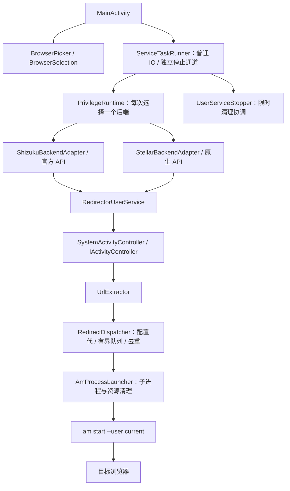

# 架构

应用把界面生命周期、权限后端和浏览器重定向分开。**两个后端共享业务服务，每次会话只归属于创建它的一个后端。**

## 模块与约束

| 模块 | 责任 |
| --- | --- |
| `MainActivity`、浏览器菜单类 | 本地配置、菜单草稿、启停状态与后台服务连接；点开启才提交草稿 |
| `BrowserDiscovery`、`BrowserEligibility` | 根据公开 IntentFilter 查询/判断通用 HTTP 与 HTTPS 处理能力；排除仅处理特定链接的入口 |
| `ServiceTaskRunner` | 应用进程内共享的有界任务通道：普通 IO 单线程/队列 8，停止单线程/队列 1，避免普通 RPC 卡住时饿死停止协调 |
| `PrivilegeRuntime` 与两个 adapter | 后端可用性、授权、会话固定、后端专属移除与来源 Binder 检查 |
| `NativeStellarUserService` | 原生连接记录固定来源管理器，区分可信业务 Binder 与待清理身份，保留晚到 token 与失败清理记录；页面回调不直接执行停止 RPC |
| `RedirectorUserService` | 注册 Controller、筛选目标与动作、记录最近事件；把跳转交给调度器 |
| `RedirectDispatcher` | 配置代隔离、有界等待队列、按目标/网址去重、取消旧任务与发布当前配置的结果；回调提交不等待锁 |
| `AmProcessLauncher` | 单个 `am` 子进程的参数、创建、限时等待、输出读取、取消和 finally 资源清理；不拼 shell 字符串 |
| `UrlExtractor`、`SystemActivityController` | 有边界的网址解析；反射连接 ActivityManager / ActivityTaskManager 控制器接口 |
| `UserServiceStopper` 与 Binder helper | disable、后端 stop/remove、destroy 补救、Binder 死亡确认 |

业务服务与主 Activity 分处进程。Stellar（页面称“兼容服务（原生 API）”）后缀是 `redirector`，
Shizuku 是 `redirector_shizuku`；v0.3.4 使用协议 `200` / 服务代 `30005`。
页面退出清理本页连接引用，daemon 可继续运行。
Shizuku SDK 按整个 tag 解绑；`ShizukuTagOwnership` 跟踪本地归属，旧页面仅注销自身回调，
适配器确认 tag 归属安全时才调用 SDK 解绑，以免破坏新页面会话。

## 一次接管

1. Controller 回调只继续处理 `com.android.browser` 的 `ACTION_VIEW`。
2. 从 `Intent.data` 提取 HTTP/HTTPS；无法解析或处于观察模式时放行。
3. `RedirectDispatcher` 按配置代、目标与网址去重：任务等待或运行时抑制重复，成功后保留 1.5 秒窗口，失败允许立即重试。专用 worker 使用容量 8 的等待队列；停用或配置变更使旧待执行任务失效。
4. 队列满、配置过期或锁忙时提交失败并放行；入队成功或命中重复项立即拒绝原启动，worker 经 `AmProcessLauncher` 使用独立参数调用 `/system/bin/am start`。
5. 命令等待预算为 10 秒；结束后在 finally 中终止/回收子进程、关闭流并限时等待输出线程。失败或超时只更新状态，没有自动恢复原小米启动的路径；操作系统调用本身不保证可强制打断。

网址作为 `ProcessBuilder` 参数传入，不拼成 shell 命令。完整网址仍会出现在进程参数与内存，隐私边界见[隐私说明](Privacy.md)。

配置切换与真正创建进程共用提交锁，已提交系统的启动无法撤回；系统 Controller 回调使用
`tryLock`，不会等待这把锁或等待 `am` 执行完成。成功去重项按后续提交/容量清理，不是 URL 删除定时器。

## 一次停止

应用先持久保存停用意图，再调用 `disable()` 注销 Controller，然后通过原后端移除 UserService。Shizuku 使用原 `UserServiceArgs`，Stellar 使用原生 token；必要时通过已持有的业务 Binder 发送 destroy。

以上业务调用只用于未被拒绝的会话。token 验证失败、协议不兼容或协议读取超时会撤销业务调用
资格，只通过来源管理器移除；原始 Binder 保留用于死亡观测。原生记录的拒绝状态跨页面租约
保留，不会因为换页面重新变成可信。细节见 [v0.3.3 修复记录](../FIX_REVIEW_0.3.3.md)。

只有 Binder 死亡才算完成。停止超时保留后端归属；页面操作代和会话身份检查用于阻止旧回调覆盖
新状态，这属于代码约束，不能代替页面重建/晚到回调的实机验证。后端切换必须等待停止完成，
因为系统全局 `IActivityController` 不能由两套会话同时使用。

`ServiceTaskRunner` 的独立停止通道运行协调，`UserServiceStopper` 再用有界 RPC worker 执行
disable/remove/destroy/存活检查，以单调时钟约束总等待。已连接清理预算最多 4 秒；页面显式
停用还设有 12 秒总截止时间，包含重新连接等前置步骤。超时报告未确认，已发出的同步 Binder
调用可能仍在进行，不能把本地取消当作远端已终止；旧调用未结束前禁止重新开启。

本应用不更改系统默认浏览器、不处理 WebView。全局 Controller 可能被其他工具替换且无可靠的
所有权查询；`--user current` 不携带原请求的用户身份，工作资料/分身不在已验证范围。

源码根目录在 `app/src/main/java/dev/codex/mibrowserredirector/`。测试与构建入口见[开发说明](Development.md)。
