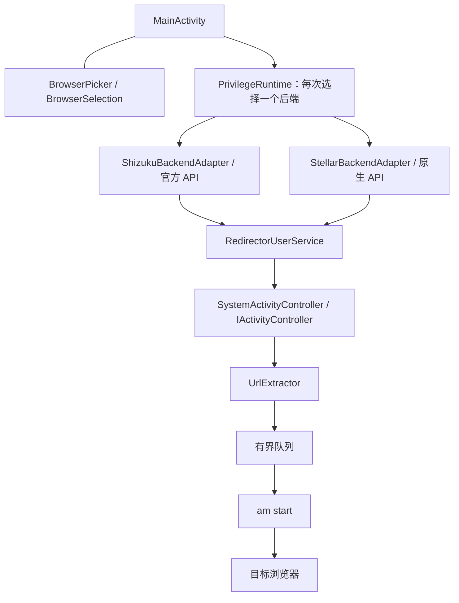

# 架构

应用把界面生命周期、权限后端和浏览器重定向分开。**两个后端共享业务服务，每次会话只归属于创建它的一个后端。**

## 模块与约束

| 模块 | 责任 |
| --- | --- |
| `MainActivity`、浏览器菜单类 | 本地配置、菜单草稿、启停状态与后台服务连接；点开启才提交草稿 |
| `PrivilegeRuntime` 与两个 adapter | 后端可用性、授权、会话固定、后端专属移除与来源 Binder 检查 |
| `RedirectorUserService` | 注册 Controller、筛选目标与动作、记录最近事件、排队转交网址 |
| `UrlExtractor`、`SystemActivityController` | 有边界的网址解析；反射连接 ActivityManager / ActivityTaskManager 控制器接口 |
| `UserServiceStopper` 与 Binder helper | disable、后端 stop/remove、destroy 补救、Binder 死亡确认 |

业务服务与主 Activity 分处进程。Stellar 后缀是 `redirector`，Shizuku 是 `redirector_shizuku`；v0.3.2 共用协议 `200` 与服务代 `30003`。页面退出清理本页连接引用，daemon 可继续运行。Shizuku SDK 按整个 tag 解绑；旧页面仅注销自身回调，适配器确认 tag 归属安全时才调用 SDK 解绑，以免破坏新页面会话。

## 一次接管

1. Controller 回调只继续处理 `com.android.browser` 的 `ACTION_VIEW`。
2. 从 `Intent.data` 提取 HTTP/HTTPS；无法解析或处于观察模式时放行。
3. 接管模式按配置代、目标与网址去重：任务等待或运行时抑制重复，成功后保留 1.5 秒窗口，失败允许立即重试。启动使用单线程执行器，等待队列容量为 8；停用或配置变更使旧待执行任务失效。
4. 入队失败则放行；入队成功立即拒绝原启动，执行器使用独立参数调用 `/system/bin/am start` 转交网址。
5. 目标启动命令最多等待 10 秒。失败或超时只更新状态，当前没有自动恢复原小米启动的路径。

网址作为 `ProcessBuilder` 参数传入，不拼成 shell 命令。完整网址仍会出现在进程参数与内存，隐私边界见[隐私说明](Privacy.md)。

## 一次停止

应用先持久保存停用意图，再调用 `disable()` 注销 Controller，然后通过原后端移除 UserService。Shizuku 使用原 `UserServiceArgs`，Stellar 使用原生 token；必要时通过已持有的业务 Binder 发送 destroy。

只有 Binder 死亡才算完成。停止超时保留后端归属；界面旋转或重开后的旧异步回调不能覆盖新会话。后端切换必须等待停止完成，因为系统全局 `IActivityController` 不能由两套会话同时使用。

源码根目录在 `app/src/main/java/dev/codex/mibrowserredirector/`。测试与构建入口见[开发说明](Development.md)。
